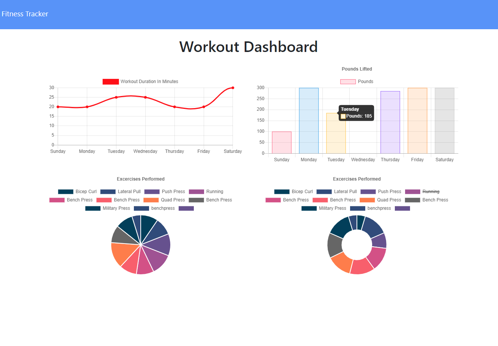

 
  
 
 
   
 
 # Workout Tracker  
 
A full-stack application used to create excercises and track your workout.  Technologies used are Javascript, express, Node JS, Mongo DB, Mongoose, html and Css.  

 
 
 

## Table of Contents

* [Installation](#Installation)  
* [Contribution](#Contribution)    
* [Usage](#Usage)  
* [Team](#Author)  
* [Credits](#Credits)  
  
 ---
 
 
## Installation

Feel free to [clone the repo](https://github.com/Cenzo-cmd/Workout-Tracker) and run locally by using the terminal/bash command `node server` .  Or you can visit [here](https://whispering-headland-88180.herokuapp.com/?id=5fb5eed23226a00017fe2d2f) to view the deployed app.

## Contribution

Please contact any of the team members below if you find an issue or have a suggestion for future development!

## Usage 

Just visit [here](https://whispering-headland-88180.herokuapp.com/?id=5fb5eed23226a00017fe2d2f) on Heroku and sign up to begin!  
  
This app is used to create, track and view excercises.  Simply start the app and click create workout.  All items will be stored in Mondo's Atlas DB.  

---

## Team
[Vincent Doria](https://github.com/Cenzo-cmd)  

